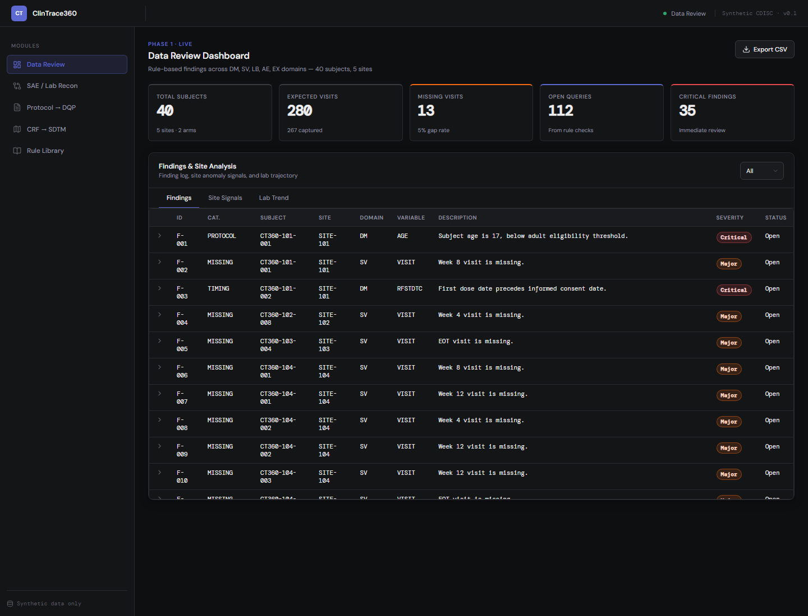
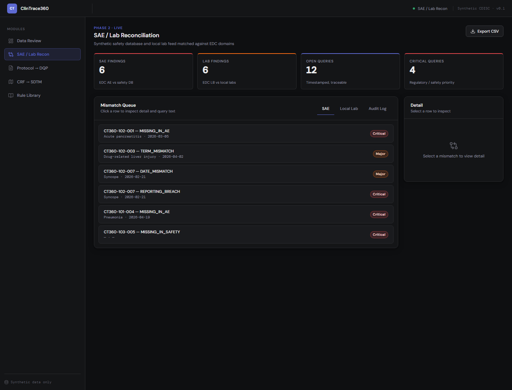
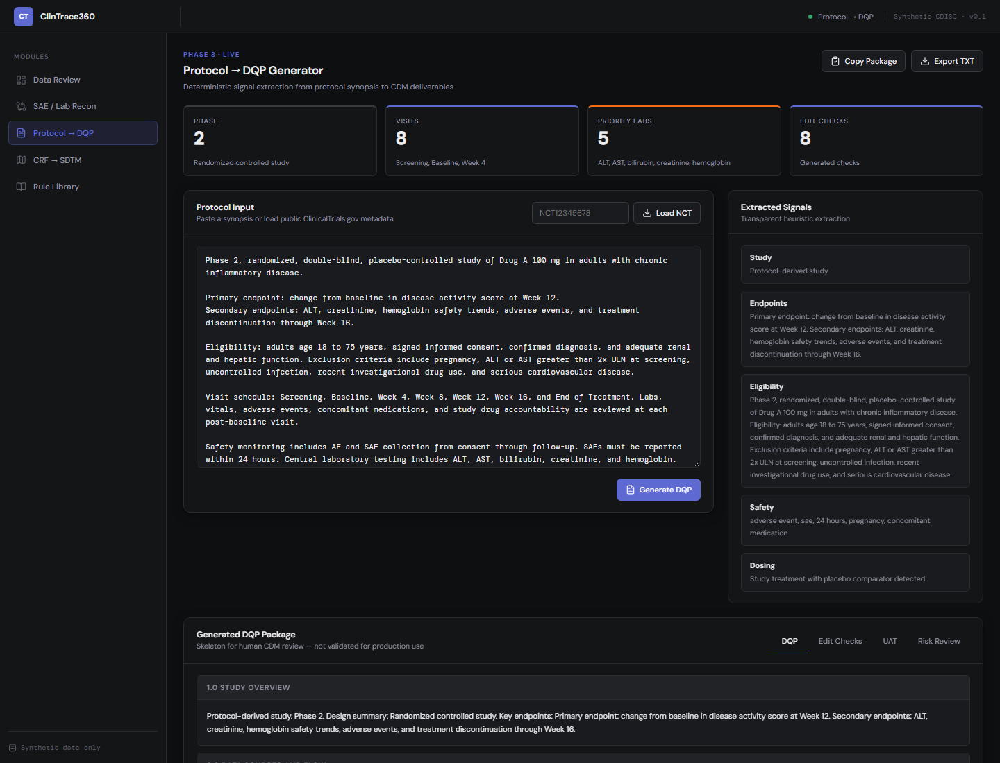
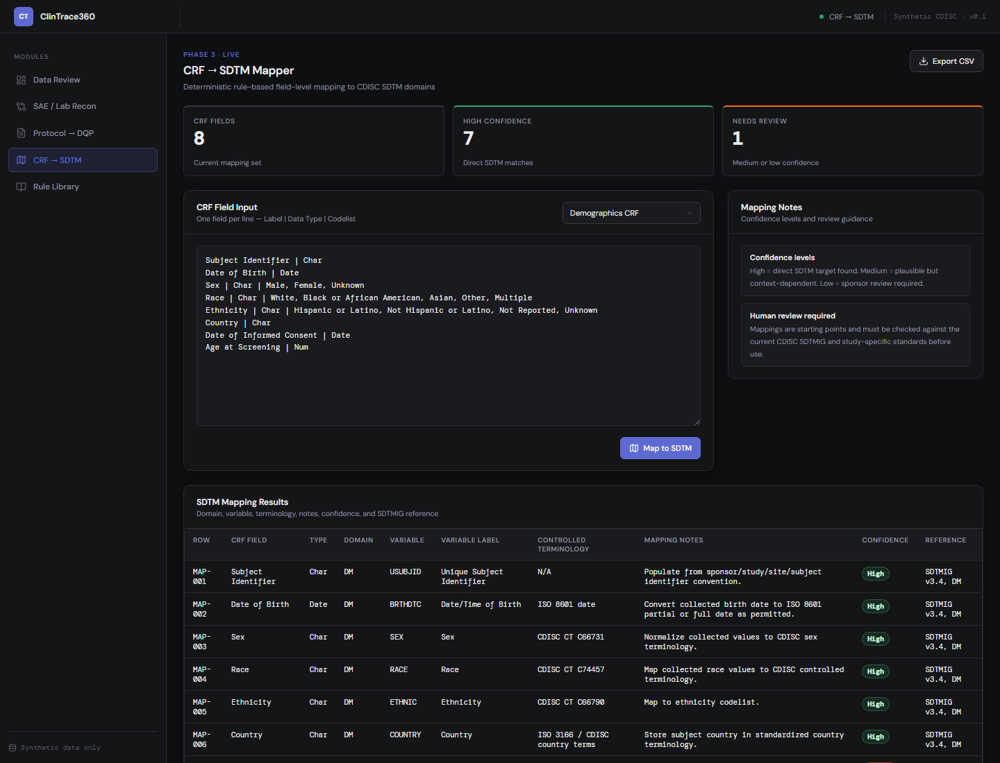
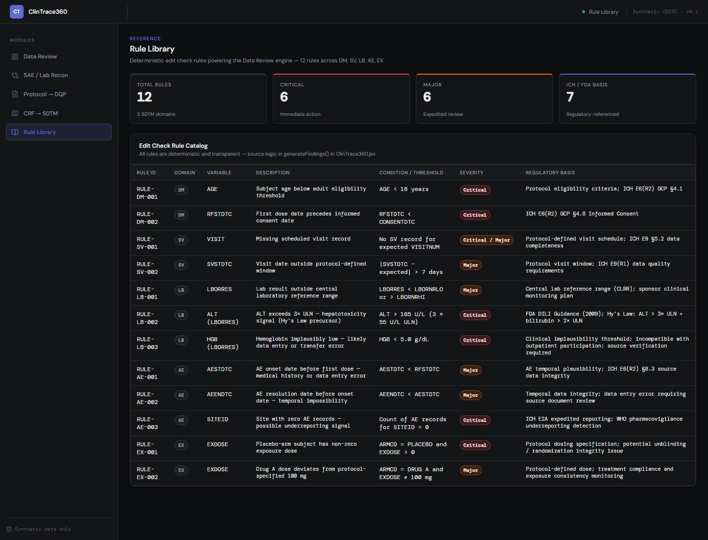
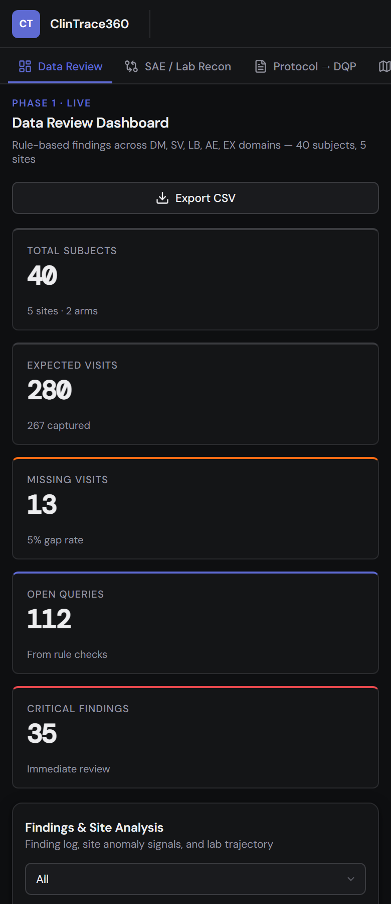

# ClinTrace360

[](https://github.com/priyamthakar/ClinTrace360/actions/workflows/ci.yml)

**Clinical Data Quality, Reconciliation, & Protocol-to-DQP Workbench**

ClinTrace360 is a portfolio-grade, browser-based clinical data operations platform designed for Clinical Data Managers (CDMs) and Clinical Data Scientists (CDSs). It simulates realistic trial data workflows, CDISC SDTM mappings, PV Safety/Lab reconciliation, and automated query management lifecycles.

> **Note**: All data is synthetically generated on the fly. No external APIs or database connections are required, and the platform functions completely offline.

**[Live Demo → clin-trace360.vercel.app](https://clin-trace360.vercel.app)**

---

## Key Feature Spotlights

### 1. Interactive Data Review Dashboard & Drill-downs
- **Site-Level Quality Metrics**: Aggregates missing visits, range check outliers, timing infractions, protocol deviations, and dose anomalies.
- **Interactive Recharts Visualizations**: 
  - **Site Signals Bar Chart**: Click any colored bar segment (representing quality categories) to immediately filter the findings table to that specific site and category.
  - **Visit Compliance Heatmap**: Click compliance percentage cells to isolate missing visit records for specific sites and scheduled visits.
  - **Lab Trajectory Scatter Plot**: Tracks lab values (e.g., ALT, AST, HGB, PLT) across visit numbers. Normal reference ranges are highlighted; click outlier (red) data points to view detailed subject results.

### 2. Query Workbench & Lifecycle Simulation (Kanban)
- A realistic simulation of EDC query lifecycle management.
- **Workflow Columns**: Open Queries (awaiting site action) ➔ Answered Queries (site responded, pending CDM review) ➔ Closed Queries (resolved).
- **Simulated Actions**: Trigger realistic site responses (e.g., verifying source documents, correcting typos, updating safety databases) and close queries with auditor review comments.
- **Fuzzy In-Line Filter & CSV Export**: Quickly filter queries by ID, subject, or discrepancy, and export the entire audit trail as a CSV file.

### 3. Safety (SAE) & Local Lab Reconciliation
- **SAE Reconciliation**: Automatically cross-references the EDC Clinical Database (AE domain) with the safety database. Flags missing SAE records, verbatim terminology discrepancies (EDC AETERM ≠ safety SAETERM), onset date drift, and regulatory 24-hour reporting breaches.
- **Local Lab Normalization**: Compares local lab reports with EDC lab logs (`LB` domain), highlighting missing records, unit discrepancies (e.g., SI units vs. standard), and value mismatches.
- **Resolution Panel**: Select any discrepancy row to load a detailed pane comparing EDC vs. source database entries with pre-written regulatory query text.

### 4. CSV File Importer with Auto-Detection
- Ingest external datasets by dragging and dropping or selecting a CSV.
- **Heuristic Header Detection**: Automatically detects clinical domains (`dm`, `sv`, `lb`, `ae`, `ex`, `safety`, `localLabs`) based on standard CDISC headers (e.g., `AGE`, `VISITNUM`, `LBTESTCD`, `AETERM`, `EXDOSE`, `SAETERM`).
- Runs all automated clinical checks and validation rules on the custom data dynamically.

### 5. Protocol-to-DQP & CRF-to-SDTM Assistant
- **Protocol-to-DQP**: Parses a clinical study synopsis or retrieves public NCT registry data from ClinicalTrials.gov. Outputs a complete **Data Quality Plan (DQP)**, UAT test cases, and edit check specs.
- **CRF-to-SDTM Mapper**: Aligns raw Case Report Form (CRF) input with CDISC SDTM standards, mapping fields to domains, generating Controlled Terminology (CT), and assigning SDTMIG reference rules.

---

## Screenshots

### Data Review Dashboard


### SAE / Lab Reconciliation


### Protocol → DQP Generator


### CRF → SDTM Mapper


### Rule Library


### Mobile Layout


---

## Recruiter & Hiring Manager Guide

*This guide maps ClinTrace360 features directly to day-to-day requirements for Clinical Data Managers and Data Scientists.*

| Job Requirement | Associated ClinTrace360 Feature | Value Demonstrated |
| :--- | :--- | :--- |
| **eCRF Design & SDTM Mapping** | **CRF-to-SDTM Mapper** | Demonstrates deep understanding of CDISC SDTMIG standards. Shows mapping from clinical CRF fields (e.g. Demographics, ConMeds, Labs) to target SDTM variables, applying Controlled Terminology (CT), and assigning confidence levels. |
| **Edit Check Spec & DQP Compilation** | **Protocol-to-DQP / Rule Library** | Illustrates the translation of protocol synopses into actionable Data Quality Plans (DQPs). Demonstrates writing edit check logic (e.g. range, timing, consistency checks) and mapping protocol criteria to data points. |
| **User Acceptance Testing (UAT)** | **UAT Cases Output** | Automates the creation of step-by-step UAT scripts (with inputs, expected results, and steps) to test EDC entry validations, showing readiness for study start-up. |
| **SAE & Lab Reconciliation** | **Reconciliation Module** | Simulates safety reconciliation against external safety databases (PV) and clinical EDC data. Aligns adverse event terms (Verbatim vs. Safety Terms), verifies reporting timelines (24-hr rules), and normalizes local lab SI conversions. |
| **Data Review & Issue Log Tracking** | **Data Review Dashboard / Query Workbench** | Models the daily clinical data review workflow. Shows site anomaly load tracking, compliance monitoring, and handling of issue logs through a query lifecycle simulation. |
| **Database Lock Procedures** | **Query Workbench (Kanban)** | Simulates the query cleaning pipeline required for interim locks and final database lock (DBL). Ensures zero open queries remain before DBL. |

---

## Seeded Data Signals & Quality Checks

The synthetic dataset implements realistic clinical data quality signals:

| Signal / Rule | Domain | Severity | Clinical / Operational Rationale |
| :--- | :--- | :--- | :--- |
| **Drug-Induced Liver Injury (DILI)** | `LB` | Critical | Elevated ALT levels >3x Upper Limit of Normal (ULN) at SITE-103. |
| **AE Underreporting** | `AE` | Critical | SITE-104 has zero Adverse Events recorded across all subjects, indicating compliance issues. |
| **Implausible Values** | `LB` | Critical | Hemoglobin values <5 g/dL flagged as potential data entry typos. |
| **Pre-consent Dosing** | `DM`/`EX` | Critical | Subject first dose date (`RFSTDTC`) precedes consent date (`CONSENTDTC`). |
| **Underage Enrollment** | `DM` | Critical | Enrolled subject is under 18 years old (eligibility violation). |
| **SAE Discrepancies** | `AE`/`Safety` | Critical/Major | Serious AEs in EDC missing in Safety PV database, term mismatches, or date discrepancies. |
| **24-hour Reporting Breach** | `Safety` | Critical | SAE report date exceeds 1 day from onset date (regulatory violation). |
| **Dose Inconsistency** | `EX` | Major/Critical | Placebo subject with non-zero dose, or Drug A subject dosed outside 100mg protocol. |

---

## Project Architecture

ClinTrace360 utilizes a modular layout separating state, UI components, domain rules, and helper utilities.

```
src/
├── main.jsx                 # Entry point with ErrorBoundary wrapper
├── ClinTrace360.jsx         # Orchestrator matching active modules & state
├── styles.css               # Core CSS layout with Light/Dark variables
├── components/              # Reusable UI elements
│   ├── AppShell.jsx         # Sidebar and header navigation wrapper
│   ├── DataTable.jsx        # Data table with sorting & fuzzy filtering
│   ├── FileUpload.jsx       # CSV Importer supporting drag-and-drop
│   ├── ThemeToggle.jsx      # Theme switcher (Light / Dark)
│   ├── Kpi.jsx              # Statistical KPI numeric display card
│   └── Badge.jsx            # Multi-colored status and severity badges
├── constants/               # Controlled lists, schemas, and templates
│   ├── crfTemplates.js      # Raw CRF templates (AE, DM, conmed, etc.)
│   ├── sampleProtocol.js    # Pre-loaded clinical trials synopsis
│   ├── ruleLibrary.js       # Data check rule definitions
│   └── sites.js             # Site and Visit structures
├── engines/                 # Logical parsing, verification, and mapping engines
│   ├── ruleEngine.js        # Evaluates synthetic trial data for quality flags
│   ├── reconciliation.js    # Cross-compares EDC and Safety database records
│   ├── queryEngine.js       # Manages state changes for EDC Kanban simulation
│   ├── csvParser.js         # Parses uploaded CSV text and detects domains
│   ├── sdtmMapper.js        # Maps CRF fields to CDISC SDTM domains
│   ├── dqpGenerator.js      # Extract protocol text and builds DQP documents
│   └── dataGenerator.js     # Creates 40 synthetic subject profiles
└── utils/                   # Clean helper methods
    ├── csv.js               # In-browser CSV downloads
    ├── date.js              # Timing calculations and date intervals
    ├── storage.js           # Read/write access to browser LocalStorage
    └── text.js              # Term normalization and string formatting
```

---

## Stack

- **Build**: Vite 7
- **UI**: React 19, vanilla CSS Custom Properties
- **Charts**: Recharts 3.5 (Scatter, Heatmap, Stacked Bar Charts)
- **Icons**: Lucide-react 0.556
- **Typography**: DM Sans + DM Mono (for code, IDs, dates, and query details)
- **Storage**: In-browser `localStorage` for active session persistence
- **Theme**: Light and Dark theme options (controlled via `data-theme` attribute)
- **CI/CD**: GitHub Actions (install, test, build verification)

---

## Run Locally

```bash
git clone https://github.com/priyamthakar/ClinTrace360.git
cd ClinTrace360
npm install
npm run dev
```

Open **http://localhost:5173** to view the app.

```bash
npm run build    # production build -> dist/
npm test         # run Vitest unit test suite
npm run preview  # preview production build locally
```

---

*For portfolio demonstration purposes only. Synthetic datasets contain no PHI or real patient records. Not validated for production clinical trial execution.*
